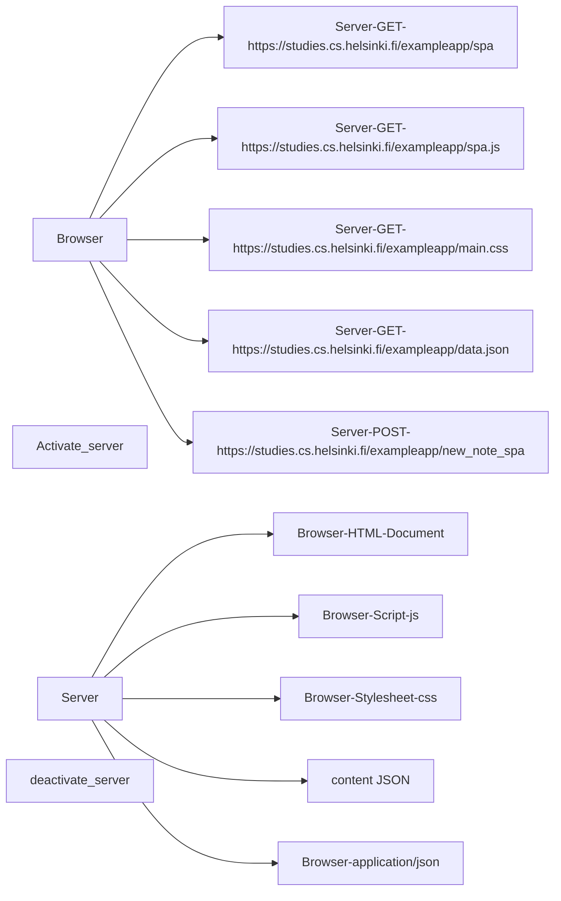

```mermaid
graph LR;

    Browser-->Server-GET-https://studies.cs.helsinki.fi/exampleapp/spa;
    Activate_server;
    Server-->Browser-HTML-Document;
    deactivate_server;

    Browser-->Server-GET-https://studies.cs.helsinki.fi/exampleapp/spa.js;
    Activate_server;
    Server-->Browser-Script-js;
    deactivate_server;
    
    Browser-->Server-GET-https://studies.cs.helsinki.fi/exampleapp/main.css;    
    Activate_server;
    Server-->Browser-Stylesheet-css;
    deactivate_server;

    Browser-->Server-GET-https://studies.cs.helsinki.fi/exampleapp/data.json;
    Activate_server;
    Server-->Browser-[content JSON];
    deactivate_server;

    Browser-->Server-POST-https://studies.cs.helsinki.fi/exampleapp/new_note_spa;
    Activate_server;
    Server-->Browser-application/json;;
    deactivate_server;
    
``` 